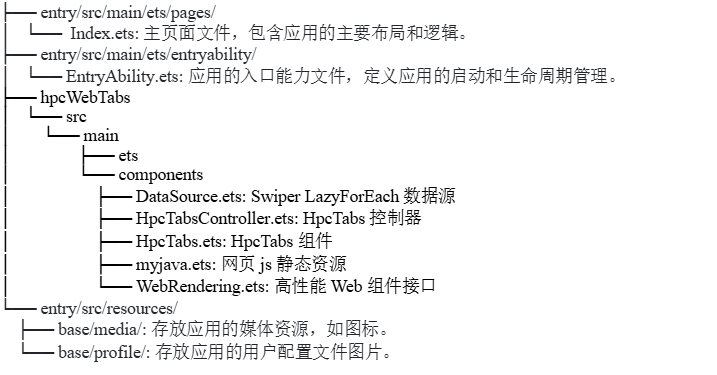

# hpc-web-tab

## 简介

本作品旨在设计并实现一个高性能的Tab切换组件，以解决现代移动设备中由于屏幕空间限制而导致的内容分布和切换问题。通过使用ArkWeb组件提供的高性能实践方法，如预加载、预渲染等，我们显著提升了Tab页切换的速度和流畅度，从而优化用户体验。

目前已实现如下功能：

- 该库通过获取用户指定的网页列表，通过切换组件进行页面切换

- 支持开发者根据需求灵活地设置Tab组件的风格

- 支持用户自定义TabItem和TabIndicator的构建模式

- 使用高性能Web组件，提升页面显示效率和页面切换速度

## 效果展示


## 使用说明

### 导入

```
import {HpcTabs, HpcTabsController} from 'hpcwebtabs'
```

### 使用

```
HPCController = new HpcTabsController()
@Local tabs: Array<string> = [
    'https://m.baidu.com/',
    'https://m.thepaper.cn/',
    'https://www.openharmony.cn/'
]
@Local names: Array<[string, Resource]> = [
    ['百度新闻', $r('app.media.mine_selected')],
    ['澎湃新闻', $r('app.media.mine2_selected')],
    ['鸿蒙', $r('app.media.mine3_selected')]
];


HpcTabs({
    WebUrl: this.tabs,
    names: this.names,
    barMode: "fixed",
    tabController: this.HPCController,
    tabStyle: {
      indicatorWidthWrapTab: true,
      fontColorSelect: Color.Blue
    },
    onWebTabIndicatorBuilder: () => {
      this.TabIndicator()
    },
    onWebTabBarBuilder: (tab, index) => {
      this.TabItem(tab, index)
    }
})

//自定义TabIndicator与TabItem
@Builder
TabIndicator(){
    Stack().width('100%').height('100%')
      .backgroundColor(Color.Gray).borderRadius(12)
}

@Builder
TabItem(tab:[string, Resource],index:number){
    Column(){
      Image(tab[1]).width(20).margin({bottom:4})
      Text(tab[0])
        .fontColor(this.HPCController.selectedTabIndex == index ? Color.Black : Color.Gray)
        .fontWeight(this.HPCController.selectedTabIndex == index ? FontWeight.Medium : FontWeight.Normal)
        .fontSize(this.HPCController.selectedTabIndex == index ? 18 : 16)
        .animation({ duration: 300 })
    }
}
```


## 接口说明

### HpcTabs组件

| 属性                     | 类型                      | 是否必须指定 | 说明                              |
| ------------------------ | ------------------------- | ------------ | --------------------------------- |
| tabController            | HpcTabsController         | 是           | tab控制器                         |
| WebUrl                   | string[]                  | 是           | 网页内容                          |
| names                    | Array<[string, Resource]> | 是           | tabItem的内容，包括文字与图片内容 |
| barMode                  | string                    | 是           | tabBar的形式                      |
| tabStyle                 | TabsStyle                 | 否           | tab的样式                         |
| onWebTabIndicatorBuilder | Builder                   | 否           | 用户指定indicator的构建函数       |
| onWebTabBarBuilder       | tabItemContent[]          | 是           | 用户定制tab的构建函数             |


### TabStyle说明

| 属性                  | 类型            | 是否必须指定 | 说明                                                         |
| --------------------- | --------------- | ------------ | ------------------------------------------------------------ |
| barHeight             | number          | 否           | TabBar高度，默认50                                           |
| tabItemPadding        | number          | 否           | TabItem左右Padding 默认6                                     |
| animationDuration     | number          | 否           | 动画时长                                                     |
| fontSize              | number          | 否           | 文字大小                                                     |
| fontSizeNormal        | number          | 否           | 默认文字大小                                                 |
| fontSizeSelect        | number          | 否           | 选中文字大小                                                 |
| fontColor             | ResourceColor   | 否           | 文字颜色                                                     |
| fontColorSelect       | ResourceColor   | 否           | 选中文字颜色                                                 |
| fontColorNormal       | ResourceColor   | 否           | 默认文字颜色                                                 |
| fontWeight            | FontWeight      | 否           | 文字权重                                                     |
| fontWeightNormal      | FontWeight      | 否           | 默认文字权重                                                 |
| fontWeightSelect      | FontWeight      | 否           | 选中文字权重                                                 |
| showIndicator         | boolean         | 否           | 是否显示指示器                                               |
| indicatorWidth        | number          | 否           | 指示器宽度                                                   |
| indicatorHeight       | number          | 否           | 指示器高度                                                   |
| indicatorPadding      | number｜Padding | 否           | 指示器内部Padding                                            |
| indicatorMargin       | number｜Padding | 否           | 指示器外部边距                                               |
| indicatorColor        | ResourceColor   | 否           | 指示器颜色                                                   |
| indicatorRadius       | number          | 否           | 指示器圆角                                                   |
| indicatorAlignment    | Alignment       | 否           | 指示器位置                                                   |
| indicatorWidthWrapTab | boolean         | 否           | 如果为true指示器宽度自适应tab宽度，false则以indicatorWidth为准 |


## 约束和验证

在下述版本验证通过：

| 开发板 | DevEco Studio | SDK    |
| ------ | ------------- | ------ |
| RK3568 | 5.0 Release   | API 12 |
|        |               |        |


## 项目结构



## 开源协议

本项目基于 [Apache License 2.0](https://gitee.com/link?target=https%3A%2F%2Fwww.apache.org%2Flicenses%2FLICENSE-2.0.html) ，请自由地享受和参与开源。
